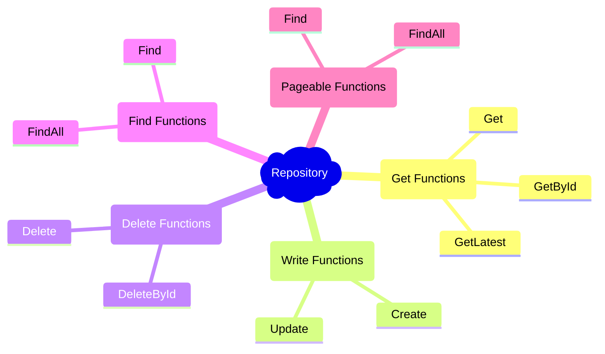

# GORMET

> A Gorm Gourmet repository pattern implementation

The main idea behind this project is to create an implementation of the Repository design pattern for golang. 

It introduces a layer over the fantastic ORM library for Golang - [GORM](http://gorm.io), to facilitate it use and reduce the amount of code used to perform mainly paged searches in the database

## Logical Organization

This project is logically structured, containing as the center of everything the Repository that provides 5 (five) different types of functions listed below:

* __Get Functions:__ Set of functions that aim to obtain one and only one instance of an object;
* __Write Functions:__ Set of functions focused on saving or changing objects in the database;
* __Delete Functions:__ Set of functions to delete an object from the database, either physically or logically, depending on the configuration used;
* __Find Functions:__ Conglomerate of functions to perform search in the database and return a list of [GORM](http://gorm.io) objects
* __Pageable Functions:__ Similar to the find functions, this set of functions has the ability to make requests against the database and obtain a paging object, which can be navigated to obtain other pages.

Abaixo está impresso um diagrama de mapa mental que descreve o grupo descrito acima e identifica cada uma de suas funções.

## Examples